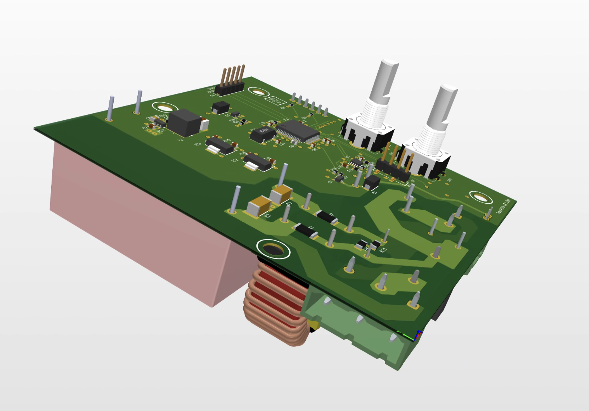
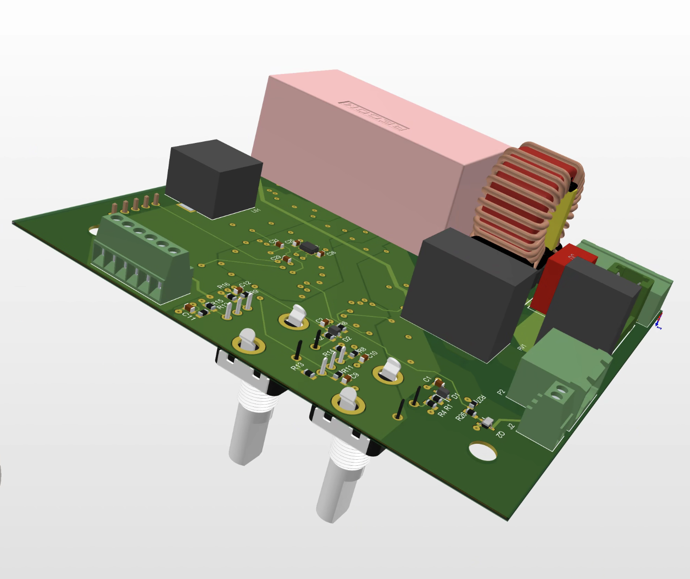
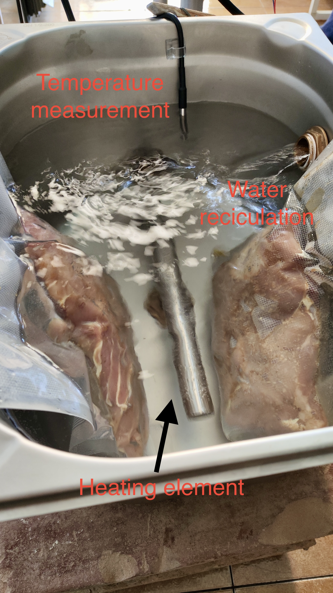
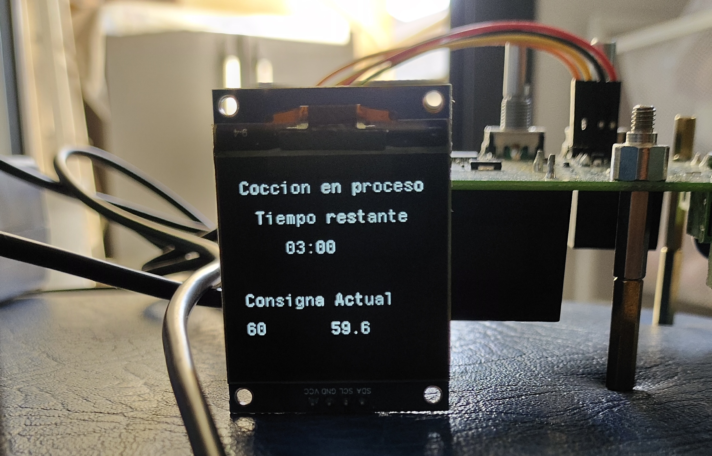

# Overview
This project is a custom-built sous vide. It features a robust PCB design and embedded programming with RTOS. Heating power, water recirculation
and sensing elements can be easily improved to fulfill custumer requierements.
# Features
## Hardware
* Heating Element: 1500W, 230VAC to provide rapid and consistent heating.
* Temperature Sensor: DS18B20 digital sensor utilizing the 1-Wire protocol for accurate temperature measurements.
* Water Pump: Ensures water circulation, providing a uniform temperature throughout the cooking process.
* OLED Display: Custom interface with menus for:
  * Temperature selection
  * Time selection
  * Pre-heating mode
  * Cooking mode
  * Ability to pause and modify temperature or time during cooking.
  * Buzzer Alarm: Alerts when the cooking cycle is complete or if there is an issue.
* Safety Features: Fuse and varystor included for basic electrical protection + footprints added for EMI filtering.
* HMI Interface: Two buttons with rotary functions for easy navigation and selection.
## Software
 * Microcontroller: STM32 with FreeRTOS for real-time task scheduling.
 * 1-Wire Protocol: Implemented for communication with the DS18B20 temperature sensor.
 * Custom Menu System: The OLED display is programmed to show temperature and time settings, cooking modes, and live cooking status.
 * Alarm and Notification System: A buzzer is programmed to alert users at key moments during the cooking process.

## Images

For more details, please contact me!

